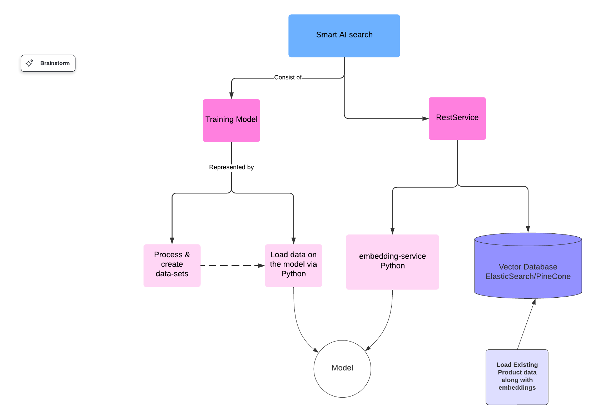

# Product-Search-AI

Product-Search-AI is a Spring Boot application designed to handle RESTful endpoints for adding and searching products. The service is architected to efficiently perform vector-based searches using data embedding via a localy hosted LLM and is leveraging microservices and containerization.

## Deployment

- **product-search-ai**:
  - This has all the code to perform search
- **product-root-infra**:
  - Creating initial resources to save terraform state.
- **product-infra**:
  - Specific to creating VPN setup and gground work for this project.
- **product-search-ai-infra**:
  - Specific to product-search-ai and contains deployment logic for the project.

## Deployment Environment

- **Cloud Provider**: AWS
- **Orchestration Platform**: Kubernetes
- **Containerization**: Docker

## Features

- **RESTful Endpoints**:
  - `search`: Accepts a query string and returns relevant product information.
  - `add`: Allows adding new product details to the database.
- **Microservices Architecture**:
  - Communicates with an external Python service for embedding generation.
- **Containerized Components**:
  - Spring Boot service
  - Python `embedding-service`
  - MongoDB database
- **Kubernetes Deployment**:
  - All components run in separate containers within a Kubernetes cluster.

## System Workflow

1. **Search Request**:
   - The user sends a `search` request with string data, e.g., "Latest Apple iPhone."
2. **Embedding Generation**:
   - The Spring Boot service calls the `embedding-service`, a Python-based web service running in a separate container, to generate embedding data.
3. **Vector Search**:
   - The embedding data is used to perform a vector-based search in MongoDB.
4. **Result Retrieval**:
   - The search results from MongoDB are returned to the user.

## System Architecture Diagram



## Technologies Used

- **Spring Boot** (Java)
- **Python** (for the `embedding-service`)
- **MongoDB** (NoSQL database)
- **Kubernetes** (Container orchestration)
- **Docker** (Containerization)

## REST Endpoints

### 1. `POST /search`

- **Description**: Accepts a search query and returns relevant results.
- **Request**:
  ```json
  {
    "query": "Latest Apple iPhone"
  }
  ```
- **Response**:
  ```json
  {
    "results": [
      {
        "id": "123",
        "name": "Apple iPhone 15",
        "description": "Latest model of Apple iPhone."
      }
    ]
  }
  ```

### 2. `POST /add`

- **Description**: Adds a new product to the database.
- **Request**:
  ```json
  {
    "id": "123",
    "name": "Apple iPhone 15",
    "description": "Latest model of Apple iPhone."
  }
  ```
- **Response**:
  ```json
  {
    "message": "Product added successfully"
  }
  ```

## Prerequisites

- **Docker**: Ensure Docker is installed and running.
- **Kubernetes Cluster**: A Kubernetes environment set up (e.g., Minikube or AWS EKS).
- **MongoDB**: A NoSQL MongoDB instance running in a container.

## Getting Started

### 1. Clone the Repository

```bash
git clone https://github.com/your-repo/product-search-ai.git
cd product-search-ai
```

### 2. Build and Run Services

- **Spring Boot Application**:
  ```bash
  ./mvnw spring-boot:run
  ```
- **Python Embedding-Service**:
  ```bash
  python3 embedding_service.py
  ```

### 3. Deploy to Kubernetes

- Apply Kubernetes configurations:
  ```bash
  kubectl apply -f k8s/
  ```

### 4. Access the Service

- Base URL: `http://<your-kubernetes-cluster-ip>:<node-port>`

## Future Enhancements

- Use ElasticSearch for storing embeddings as vector.
- Train a local model explicitly for data
- Implement caching for embedding results.
- Add authentication and authorization.

## License

This project is licensed under the [MIT License](LICENSE).

---

Happy coding! 🚀
